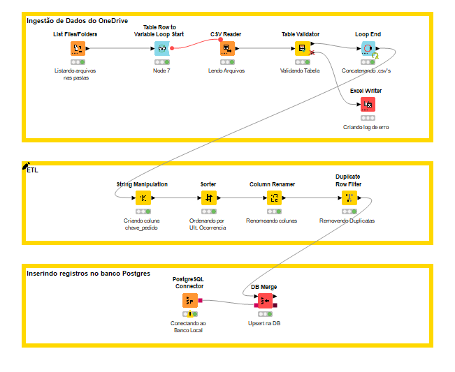

# 📦 Pipeline de Ingestão de Pedidos com KNIME + PostgreSQL

Este projeto automatiza a ingestão de arquivos `.csv` contendo pedidos comerciais, utilizando **KNIME Analytics Platform** para tratamento dos dados e **PostgreSQL** como banco relacional de destino.

---

## 🚀 Funcionalidades

- 📁 Leitura automática de múltiplos arquivos `.csv`
- 🔄 Loop com validação de estrutura de dados
- 🧼 Criação de chave única (`chave_pedido`)
- 🧹 Deduplicação com base na última ocorrência
- 📤 Upsert (inserção/atualização) no PostgreSQL via `DB Merge`
  
---

## 📂 Estrutura do Projeto

```
knime-pipeline-pedidos/
├── fluxo_csv_pedidos.knwf        # Workflow completo no KNIME
├── arquivos_exemplo/             # CSVs fictícios para testes
│   ├── pedidos_ficticio_01.csv
│   ├── pedidos_ficticio_02.csv
│   └── ...
├── screenshots/                  # Prints do fluxo e tabelas
└── README.md                     # Descrição do projeto
```

---

## 🧪 Tecnologias Utilizadas

- [KNIME Analytics Platform](https://www.knime.com/)
- PostgreSQL
- Faker (para gerar dados fictícios)
- Python (para pré-processamento e anonimização)

---


## 📝 Como Executar

1. Baixe e instale o [KNIME](https://www.knime.com/downloads)
2. Importe o arquivo `.knwf` (`File > Import KNIME Workflow`)
3. Altere o caminho dos arquivos CSV para a pasta `arquivos_exemplo/`
4. Rode o fluxo completo

---

## 📌 Observações

- Os dados utilizados são **100% fictícios**, criados com a biblioteca `Faker`.

---

## 📸 Prints do Projeto



---
Desenvolvido com 💡 por Levi Almeida
